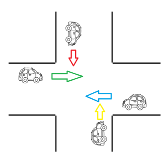

# Exercícios

1. Fazer uma aplicação de uma corrida de sapos, com 5 Threads, cada Thread controlando 1 sapo. 
    -   Deve haver um tamanho máximo para cada pulo do sapo (em metros) e a distância máxima para que os sapos percorram. 
    -   A cada salto, um sapo pode dar uma salto de 0 até o tamanho máximo do salto (valor aleatório). 
    -   Após dar um salto, a Thread, para cada sapo, deve mostrar no console, qual foi o tamanho do salto e quanto o sapo percorreu. 
    -   Assim que o sapo percorrer a distância máxima, a Thread deve apresentar que o sapo chegou e qual sua colocação.

2. 4 pessoas caminham, cada uma em um corredor diferente. Os 4 corredores terminam em uma única porta. Apenas 1 pessoa pode cruzar a porta, por vez. 
    
    Considere que cada corredor tem 200m. e cada pessoa anda de 4 a 6 m/s. Cada pessoa leva de 1 a 2 segundos para abrir e cruzar a porta. Faça uma aplicação em java que simule essa situação.

3. Fazer uma aplicação que gerencie a figura abaixo:

    

    Para tal, usar uma variável sentido, que será alterado pela Thread que controla cada carro com a movimentação do carro. Quando a Thread tiver a possibilidade de ser executada, ela deve imprimir em console o sentido que o carro está passando. Só pode passar um carro por vez no cruzamento.